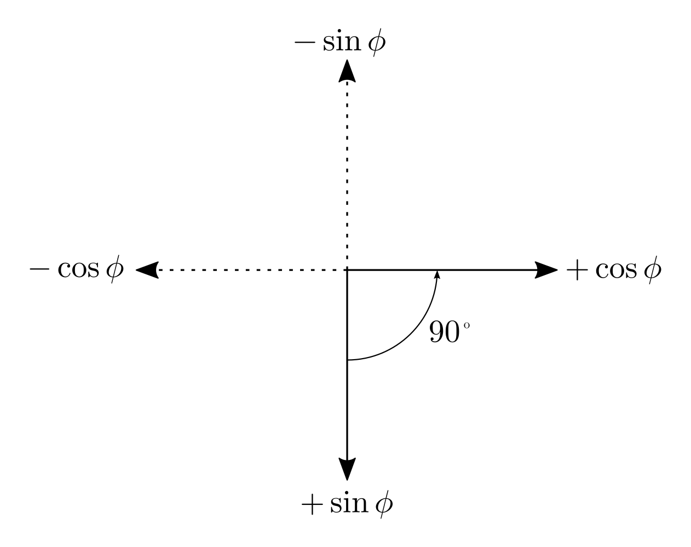

# cordic_ip


## Introduction

The CORDIC (COordinate Rotation DIgital Computer) was developed by Jack Volder in 1959 as an iterative algorithm algorithm to convert between polar and cartesian coordinates using shift, add and subtract operations only:

- Implemented with a Shift-Add/Subtract type algorithm
- Can be used to compute trigonometric, hyperbolic, linear and logarithmic functions
    - Examples: sine, cosine, polar to rectangular coordinates, etc
- CORDIC algorithm generally produce one additional bit of accuracy for each iteration
- Applications
    - Math co-processor, calculators, radar signal processors, robotics

## Circular rotation mode

In the circular rotation mode a CORDIC fuction could compute the cartisian coordinates of the target vector $\mathbf{v_{n}}$ by rotating the input vector $\mathbf{v_{0}}$ by an arbitrary angle $\phi$. So how do we calculate $x_{n}$ and $y_{n}$ based on the input vector and angle?
    
We start from the idea that we have a vector $\mathbf{v_{0}}$, a rotation matrix $\mathbf{M}$ and that by multiplying them we generate a vector $\mathbf{v_{n}}$.

<p align="center" width="100%">
  
</p>

```math
\mathbf{v_{0}} = 
\left[ 
  \begin{array}{c}
    x_{0}\\
    y_{0}
  \end{array}
\right] 

\quad \mathrm{,} \quad

\mathbf{M} = 
\left[
  \begin{array}{cc}
    \cos \phi & -\sin \phi \\
    \sin \phi & \cos \phi
  \end{array}
\right]

\quad \mathrm{,} \quad

\mathbf{v_{n}} = 
\left[
  \begin{array}{c}
    x_{n} \\
    y_{n}
  \end{array}
\right]
```

then 

```math
\mathbf{v_{0}} \mathbf{M} = \mathbf{v_{n}} 

\quad \text{or} \quad

\left[ 
  \begin{array}{cc}
    \cos \phi & -\sin \phi \\
    \sin \phi & \cos \phi
  \end{array}
\right]

\left[ 
  \begin{array}{c}
    x_{0} \\
    y_{0}
  \end{array}
\right] = 

\left[ 
  \begin{array}{c}
    x_{n} \\
    y_{n}
  \end{array}
\right]
```

so that 

```math
\begin{array}{lll}
  x_{n} & = & x_{0} \cos \phi - y_{0} \sin \phi \\
  y_{n} & = & x_{0} \sin \phi + y_{0} \cos \phi
\end{array}
```

It is important to remember that to obtain the rotation matrix you have to locate the final position to which the unit vectors of the reference plane move, in this particular case the unit vector $\hat{x}$ which originally was at $<1, 0>$ ends in $< \cos \phi, \sin \phi>$, and for the unit vector $\hat{y}$, $<0,1>$ ends in $< \cos \phi + 90^{\circ}, \sin \phi + 90^{\circ} >$ but using the following figure they can be converted to $< -\sin \phi, \cos \phi>$. 

<p align="center" width="100%">
  
</p>

if we factor $\cos{\phi}$ we get

```math
\begin{array}{lll}
  x_{n} & = & \cos \phi(x_{0} - y_{0} \tan \phi) \\
  y_{n} & = & \cos \phi(y_{0} + x_{0} \tan \phi)
\end{array}
```

If the rotation angles are restricted so that $\tan \phi = \pm 2^{-i}$, the multiplication by the tangent term is reduced to a simple shift operation.

<div align="center">

| $i$ | $\phi$  $=\arctan{(2^{-i})}$ | $\phi \text{ deg}$ | $\phi \text{ rad}$ | $\tan \phi = \pm 2^{i}$ |
| --- | ---------------------------- | ------------------ | ------------------ | ----------------------- |
| $0$ | $\arctan(1/1)$               | $45.0000$          | $0.7854$           | $1/1$                   |
| $1$ | $\arctan(1/2)$               | $26.5651$          | $0.4636$           | $1/2$                   |
| $2$ | $\arctan(1/4)$               | $14.0362$          | $0.2450$           | $1/4$                   |
| $3$ | $\arctan(1/8)$               | $7.1250$           | $0.1244$           | $1/8$                   |
| $4$ | $\arctan(1/16)$              | $3.5763$           | $0.0624$           | $1/16$                  |
| $5$ | $\arctan(1/32)$              | $1.7899$           | $0.0312$           | $1/32$                  |
| $6$ | $\arctan(1/64)$              | $0.8952$           | $0.0156$           | $1/64$                  |
| $7$ | $\arctan(1/128)$             | $0.4476$           | $0.0078$           | $1/128$                 |
| $8$ | $\arctan(1/256)$             | $0.2238$           | $0.0039$           | $1/256$                 |
| ... | ...                          | ...                | ...                | ...                     |

</div>

The desired angle of rotation is obtained by performing a series of successively smaller and smaller elementary rotations. Where:

```math
i = 0, 1, 2, \ldots ,n-1, \;\; \tan \phi = \pm 2 ^{-i}
```

and we define an auxiliary variable to define the direction of rotation as:

```math
Z_{i+1} = Z_{i} - \arctan(d_{i}2^{-i})
```


## References

- [1] CORDIC design in Verilog to produce sine and cosine functions, (Nov. 12, 2013). Accessed: Jul. 07, 2024. [Online Video]. Available: <https://www.youtube.com/watch?v=pTgmySlijAs>
